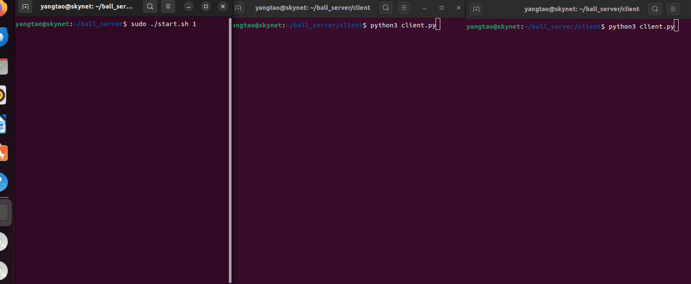

# mini_game_server

## 项目简介：

这是一个基于skynet+protobuf+mysql+redis设计的小型游戏服务器，主要游戏逻辑简单模拟《球球大作战》。

- 采取分布式设计方案，可以支持多个节点横向拓展。理论上，只要开启更多节点，就能够支持更多玩家。
- 服务端包含了多个类型的服务，符合Skynet设计理念。每个服务都是轻量级的，功能单一，通过多个服务协作完成服务端功能。
- 实现了分布式登录流程，能正确完成角色对象的构建和销毁，并防止用户重复登录。
- 使用mysql存储用户数据，并加了一层redis作为缓存，以处理大量的并发数据请求。
- Lua处理大量可变字符串的效率较低，所以客户端和服务器使用protobuf进行通信，减轻gateway的负担。


## 效果展示：




## 使用方法：

1. 先clone本项目

   ```bash
   git clone https://github.com/MrAriten/mini_game_server.git
   ```

2. 在编译完skynet和redis，并安装完mysql后，启动redis服务器和mysql。

3. 在`./etc/runconfig.lua`下修改自己想要的服务器节点配置。

4. 分别在`./service/login/init.lua`和`./serivce/agent/init.lua`的`init()`函数中修改连接mysql和redis的配置

5. 在服务端运行`sudo ./start.sh 1`，数字是你想开启的节点

6. 在客户端修改配置并运行'`/client/client.py`就能和服务端发起连接

7. 客户端的命令如下

   |            命令            |                             响应                             |
   | :------------------------: | :----------------------------------------------------------: |
   |  login,username,password   | 登录到服务器中，如果账号存在且密码正确会登陆成功，否则根据账号是否存在返回账号不存在或者密码错误 |
   | register,username,password |   向服务器发起注册，如果账号已存在则注册失败，否则注册成功   |
   |           check            |                      查看用户当前的信息                      |
   |           enter            |   随机分配到一个战场，此时服务器会不断更新战场信息给客户端   |
   |           leave            |                      退出战场，进行结算                      |

8. 本项目没有怎么实现战场逻辑，对于退出结算仅是简单的将用户的金币+1。


## 目录结构：

### client：

1. `client_pb2.py`：由`./service/gateway/proto/client.proto`转换而来，用于在`python`中实现protobuf的通信。
2. `client.py`：主要功能是向服务器发送数据，用户在命令行输入的字符串会转换为`proto`定义的字节流，同时创建了一个线程异步接受来自服务器的推送。

### etc：

服务器的配置信息，通过在`runconfig.lua`中设置节点信息，可以实现简单的横向拓展

### lualib：

只有一个`service.lua`文件，其作用是封装其他服务常用的`API`，例如启动逻辑，消息分发还有一些辅助方法。在每个`service`的文件开头都会有

```lua
local s = require "service"
```

然后通过定义自己的s类方法就能封装这些服务的功能。

### service/gateway：

`gateway`是服务器的网关，是连接客户和服务器的桥梁，其主要功能之一是不断处理来自客户端的请求，并根据请求转发到其他的`service`中，例如注册，登录请求转发到`login`服务中，其余都转发到`agent`服务中。

同时`gateway`也会接受来自各服务的消息，转发给客户端。

在`gateway`文件夹下还有`protobuf`的协议，本项目的协议较为简单，客户端和服务器的通信格式都是`cmd,arg1,arg2,...`的形式

```protobuf
syntax = "proto3";
package client;

message Client {
  // 第一个元素是字符串
  string first_element = 1;
  // 后续元素都是整数
  repeated int32 integer_elements = 2 [packed=true];
  // 第三个元素可能是字符串
  string optional_string_element = 3;
}
```

### service/login：

这是登录服务，主要处理登录与注册逻辑。

在`login`中向`mysql`发送请求都要经过查询`redis`，如果是注册请求，如果账号已存在则注册失败，否则注册成功。

如果是登录请求，会先检查用户是否存在以及密码是否正确，如果没问题，则会向`agentmgr`发送请求创建一个对应的`agent`，如果已登录则会给旧的`agent`发送断开命令，并通过`gateway`转告用户。

### service/agent：

每个`agent`对应一个游戏角色，创建服务后，它负责维护当前角色的数据，同时负责处理除了登录和注册以外的所有用户请求，也就是用户上线后的请求都由它负责。在这里主要负责与战场`scene`的连接和离开，以及角色在战场上的操作。

### service/agentmgr：

负责管理各个`agent`，其维护着每个`agent`和客户端的连接，主要负责登录仲裁（判断玩家是否可以登录），顶替已在线玩家，让`nodemgr`创建`agent`服务。

### service/nodemgr：

仅负责创建agent服务，核心代码就一段

```lua
s.resp.newservice = function(source, name, ...)
	local srv = skynet.newservice(name, ...)
	return srv
end
```

### service/scene：

负责战场的信息处理，实时更新战场信息的同时将信息发送给所有在战场中的玩家，这块实现比较简单，只是实现了球球大作战的一部分功能，例如定时往战场添加食物，碰撞检测等。


## 服务器流程示意

### 注册流程

`client`➡ `gateway`➡`login`➡`gateway`➡`client`

客户端发起请求到`gateway`，转发到`login`进行处理，返回结果到`gateway`，再转发到client。

### 登录流程

`client`➡ `gateway`➡`login`➡`agentmgr`➡`nodemgr`➡`login`➡`gateway`➡`client`

客户端发送请求到`gateway`，接着转发到`login`处理，再询问`agentmgr`是否已存在登录，有则由它负责断开连接，然后再向`nodemgr`发送创建新agent的请求，最后再转发回客户端。

### 用户信息查询

`client`➡ `gateway`➡`agent`➡`gateway`➡`client`

用户信息都是在`agent`维护的，所有只需要转发到`agent`即可

### 战场信息获取

`scene`➡`gateway`➡`client`

在`scene`中会不断更新战场信息，并自动发送到客户端
